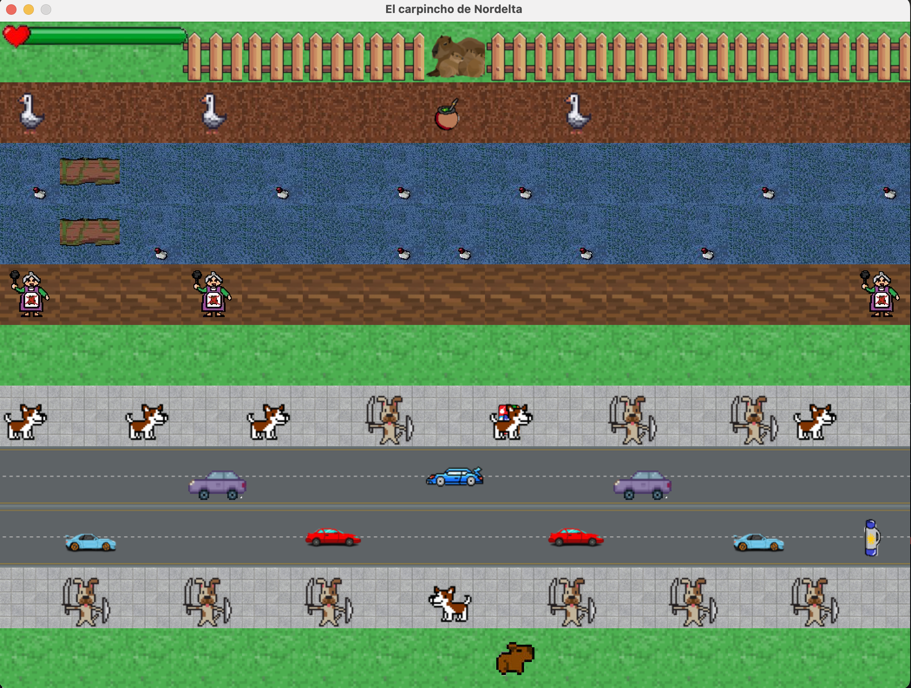
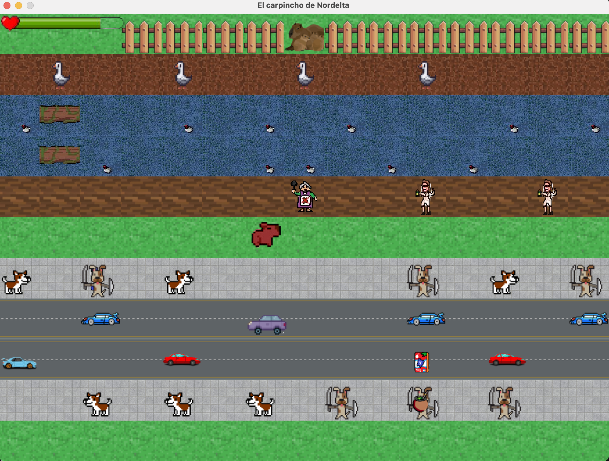

# El carpincho de Nordelta

## Equipo de desarrollo

- Lucas Allen
- Franco Paredes
- Maribel Claros

## Capturas

## Reglas de Juego / Instrucciones

Ayudá al carpincho que quiere llegar a casa con su familia. Deberás enfrentar a diferentes enemigos, algunos hacen más daño que otros y hasta lo pueden desplazar varios casilleros para diferentes direcciones. ¡Que no lo atrapen las humanas! Una vez que lo hagan no podrás salvarlo. A menos que juntes todo lo necesario para activar su super poder, ¡tomar mate!, si lo hacés será inmune a todo hasta por 5 segundos. Ojo con el río contaminado, le quita vida mientras nade por ahí.

- El carpincho se mueve con las flechas del teclado.
- Apretá la tecla e para saber cuánta energia te queda.
- Para agarrar los elementos para preparar un mate, sólo tenes que pasar por arriba de uno.
- Una vez que tengas todos los elementos, apretá x para activar el super poder.

## Otros

- Programación con Objetos I - Segundo cuatrimestre 2023. Universidad Nacional de Quilmes
- Versión de wollok: 3.0.0
- Una vez terminado, no tenemos problemas en que el repositorio sea público.
